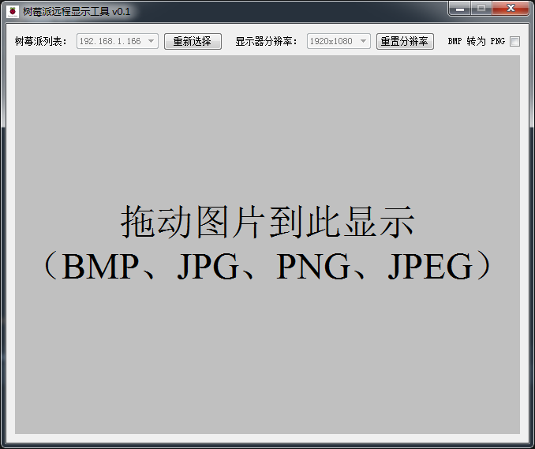
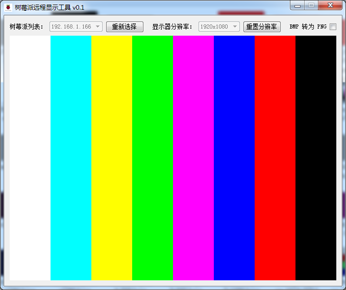

# raspberry_remote_display
========

树莓派远程显示工具，通过网络连接树莓派后，拖动图片到软件中，图像将在树莓派的 HDMI 接口显示。树莓派上需要运行 [Raspi IO Server](https://github.com/amaork/raspi-ios/releases)

## 使用说明
首先，选择要连接的树莓派的 IP 地址，然后根据需要调整显示器的分辨率。最后拖动图片到下面文字显示的框框中，图像将通过 `websocket`传送到树莓派中在 HDMI 上显示。

勾选上『BMP 转为 PNG』 后，BMP 图像在通过 `websocket ` 传送到树莓派之前，会先将图像转换为 PNG 格式传送，以压缩图片尺寸缩短传输时间，但部分黑白图像在显示的时候会出现异常。

## 技术实现
软件使用了 [raspi_io](https://github.com/amaork/raspi-io) 的 `TVService `和 `MmalGraph` 模块，分别用来调整树莓派 HDMI 输出分辨率和通过树莓派显示核心显示图像在 HDMI 端口。更详细的内容参考  [raspi_io](https://github.com/amaork/raspi-io) 

软件工作界面如下：

